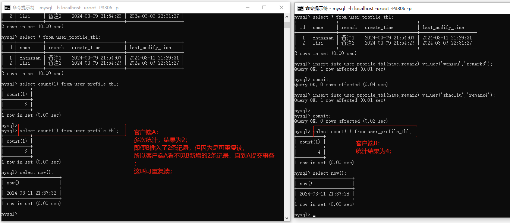

# ARTS-20240304

## 【1】Algorithm


## 【2】Review-文章评论

1. https://blog.csdn.net/yxg520s/article/details/121328097 

2. 不可重复读与幻读区别： https://en.wikipedia.org/wiki/Isolation_%28database_systems%29#Non-repeatable_reads
   1. 不可重复读：一个事务前后两次读取同一行数据，读取结果不同； （针对的同一行数据）
   2. 幻读：一个事务前后两次读取某一范围内的行数据集合，读取结果不同；（针对的是多行数据）

## 【3】Tips


## 【4】Share-数据库隔离级别要点

### 【4.1】脏读

1. 脏读定义：客户端A读取到了客户端B没有提交的写操作数据； 
2. 造成的问题：因为客户端B可能撤销写操作，则客户端A读取的数据就是脏的，即数据库不存在的数据；
3. <font color=red>解决方法</font>： 使用读已提交，可重复读（快照隔离），可串行化隔离级别；  

------

### 【4.2】脏写

1. 脏写定义：客户端A的写操作覆盖了客户端B没有提交的写操作数据；
2. 造成的问题：最后写入的数据不满足预期； 
3. 例1：客户端A和客户端B更新表1#记录1#字段1，表2#记录2#字段2的值，操作顺序如下。 
   1. 最后写入结果为  表1#字段1更新为 B1， 表2#字段2更新为 A2；即表1#字段1被客户端B更新， 表2#字段2被客户端A更新；<font color="#dd0000">客户端A或B仅更新了部分字段，即业务逻辑部分执行成功，部分执行失败； </font>  

| 时间顺序 | 客户端A                   | 客户端B                   |
| :------- | ------------------------- | ------------------------- |
| 1        | 更新表1#记录1#字段1为 A1  |                           |
| 2        |                           | 更新表1#记录1#字段1 为 B1 |
| 3        |                           | 更新表2#记录2#字段2 为 B2 |
| 4        | 更新表2#记录2#字段2 为 A2 |                           |

4. **<font color="#dd0000">解决方法</font>**：通常采用行级锁来防止脏写；当事务想修改某行记录时，它必须先获取该行记录的行级锁，一直持有该锁直到事务提交；

------

### 【4.3】不可重复读（读倾斜） 

1. 读倾斜（即不可重复读）定义： 一个事务前后两次读取同一行数据，读取结果不同； （针对的同一行数据）； （https://blog.csdn.net/qq_24054301/article/details/123086098）；
2. 造成的问题：前后两次读取结果不一致，导致系统执行决策错误； 
3. 【例】银行福利：存款1~1000元送一包纸巾；存款1001-2000元送一桶油； sql操作执行顺序如下（<font color="#dd0000">有问题，银行给张三发放了2个福利包</font>）：

| 时序 | 张三                         | 系统跑批作业                                            |
| :--- | ---------------------------- | ------------------------------------------------------- |
| 1    | 张三存入1000元（余额1000元） |                                                         |
| 2    |                              | 事务A查询存款 1-1000元的客户，系统决策给张三送一包纸巾  |
| 3    | 张三存入500元（余额1500元）  |                                                         |
| 4    |                              | 事务A查询存款 1001-2000元的客户，系统决策给张三送一桶油 |

4）**<font color="#dd0000">解决方法</font>**： 使用快照隔离级别，底层使用MVCC-多版本并发控制；

- 补充：不同数据库对快照隔离级别的命名不同：
  - oracle：可串行化；
  - mysql：可重复读；
  - PostgreSQL：可重复读；  

#### 【4.3.1】MVCC-多版本并发控制详解（基于乐观锁实现）

1. MVCC的典型做法： 在读已提交隔离级别下，为每个不同查询创建一个快照； 而快照隔离级别使用同一个快照来运行整个事务；
2. MVCC具体实现：
   1. 事务开始时，数据库为每个事务分配一个单调递增的事务ID；
   2. 每条记录（数据行）都默认包含2个元字段： created_by， deleted_by 分别用于保存新增记录，删除记录的事务ID（更新记录的实现是先删除，再新增）； 
3. <font color='#dd0000'>**mvcc对数据库读写操作的处理**</font>： 
   1. 新增：新增一条记录，记录的create_by 设置为当前事务id；
   2. 删除：删除一条记录，记录的delete_by 设置为当前事务id；
   3. 更新（先删除，再新增）： 
      1. 删除原生记录：原生记录的delete_by 设置为当前事务id；
      2. 新增一条记录（原生记录修改后的副本）： 记录的create_by设置为当前事务id；
   4. 查询 ：
      1. 当前事务ID大于等于数据行#created_by；且deleted_by为空；
      2. 或者当前事务ID大于等于数据行#created_by，且deleted_by不为空且当前事务ID小于数据行#deleted_by；   
4. 可重复读例子（针对写操作，包括 insert，delete，update ）：



------

### 【4.4】更新丢失（操作顺序#读-修改-写回）

1. 更新丢失定义：两个事务同时对相同数据对象执行 <font color="#dd0000">“读-修改-写回” </font> 时，第2个事务的写操作不包含第1个事务修改后的值，就会导致第1个事务的修改值丢失；
2. 造成的问题：数据丢失； 
3. 【例1】更新账户余额：张三和李四同时向王五转账100元（<font color="#dd0000">有问题，最终王五余额错误地增加了100元</font>，而正确值应该是增加200元）   

| 时序 | 张三                                   | 李四                                   |
| :--- | -------------------------------------- | -------------------------------------- |
| 1    | 读取王五余额，等于100元                |                                        |
| 2    |                                        | 读取王五余额，等于100元                |
| 3    | 对余额加100，等于200元（事务没有提交） |                                        |
| 4    |                                        | 对余额加100，等于200元（事务没有提交） |
| 5    | 提交事务（写入余额200到王五账户）      |                                        |
| 6    |                                        | 提交事务（写入余额200到王五账户）      |

4. 【例2】张三李四<font color="#dd0000">同时更新同一个wiki页面</font>； 后提交的同学会覆盖掉前一个同学编辑的值（因为后一个同学的修改值，不包含前一个同学的修改值）

5. **<font color="#dd0000">解决方法</font>**： 
   1. 解决方法1：数据库支持**原子更新**操作， 避免读-修改-写回操作；  （即应用程序不执行修改，修改封装到sql，如 update table set value = value+1 where id=1）
   2. 解决方法2：数据库不支持原子更新操作，需要业务程序显式锁定待更新对象（<font color="#dd0000">加行锁锁for update</font>）；若有其他事务读取该数据行，则等待直到读修改写回操作的事务提交；
      1. 
   3. 解决方法3： 让操作相同数据的多个事务并发执行，但事务管理器能够**自动检测更新丢失**，中止当前事务，强制回退到<font color="#dd0000">串行的读-修改-写回方式（方法1或方法2）</font>；   
   4. 解决方法4**（CAS或乐观锁）**：CAS-compare and set，比较并设置；只有在上次读取的数据没有发生变化时才更新； update table set balance=new where id=1 and balance=old ； 

------

### 【4.5】写倾斜（查询-决策-写入）

1. 写倾斜定义：<font color="#dd0000">若不同事务同时更新不同对象，则可能发生写倾斜</font>； （补充：若不同事务同时更新相同对象，则可能发生脏写或更新丢失） ； 
2. 造成的问题：可能导致系统决策报错；  
3. 【例】医院休假制度（若值班人数大于等于2人，则允许医生请假），请假申请的处理如下（当前医院值班只有张三和李四，共2个人）：

| 时序 | 医生张三                   | 医生李四                   | 系统                                                         |
| ---- | -------------------------- | -------------------------- | ------------------------------------------------------------ |
| 1    | 提交休假申请（未提交事务） |                            |                                                              |
| 2    |                            |                            | 统计当前值班人数为2人，所以判定张三休假申请通过（事务没有提交） |
| 3    |                            | 提交休假申请（未提交事务） |                                                              |
| 4    |                            |                            | 系统统计当前值班人数为2人，所以判定李四休假申请通过（事务没有提交） |
| 5    | 提交事务                   |                            |                                                              |
| 6    |                            | 提交事务                   |                                                              |

- 【结论】<font color="#dd0000">有问题， 因为张三事务与李四事务更新了不同对象，导致系统错误判定张三和李四的休假均为审批通过，导致医院的值班人数为0</font>；

4. 解决方法：
   1. 解决方法1： 串行执行；如上例中仅允许一个医生同时提交请假申请； 
   2. 解决方法2：加行级锁for update； 如select * from table where id=1 for update ;

5. 其他写倾斜的例子（不同事务更新不同对象，最后更新结果可能不满足系统规则）： 
   1. 声明一个用户名：要求每个用户有唯一的用户名，不同用户的用户名不能重复； （采用唯一性约束解决）
   2. 防止双重开支：支付或积分相关的服务通常需要检查用户的花费不能超过其限额； 

6. 写倾斜步骤：
   1. 步骤1：查询满足条件的行；
   2. 步骤2：根据查询结果，系统决定是否进入下一步（如是否通过请假申请）；
   3. 步骤3：执行写操作（包括 insert，update，delete）； 

7. <font color="#dd0000">**产生写倾斜根因：步骤3的写操作会改变步骤2做出决策的前提条件**</font>； （以医生请假为例，步骤1统计在岗医生是2人，步骤2判断结果满足即大于1，系统决策审批通过，步骤3把请假医生的工作状态更新为休假，显然步骤3写操作改变了步骤2的统计结果）

8. 实体化冲突：把幻读问题转变为针对数据库中一组具体行的锁冲突问题； （若步骤1的查询结果返回了数据行，则对数据行加行锁可以解决写倾斜的问题；若步骤1没有返回结果行，则不能直接加行锁；能不能间接加行锁即对其他数据加行锁来达到串行化的目的；这种间接加行锁的方法就是实例化冲突） 

------

### 【4.6】幻读 

1. 幻读定义：一个事务前后两次读取某一范围内的行数据集合，读取结果不同；（针对的是多行数据）；   

2. 【例】修改用户名：要求用户名唯一（隔离级别可重复读）；

| 序   | 用户张三                                                     | 用户李四        |
| ---- | ------------------------------------------------------------ | --------------- |
| 1    | 查询name=jerry的用户，为空；                                 |                 |
| 2    |                                                              | 修改name为jerry |
| 3    |                                                              | 提交事务成功    |
| 4    | 修改name为jerry                                              |                 |
| 5    | 提交事务失败，报主键冲突                                     |                 |
| 6    | 再次查询name=jerry的用户，为空；【<font color="#dd0000">**幻觉？**</font>】 |                 |
| 7    | 回滚事务；再次查询name=jerry的用户；【有值】                 |                 |

- 
- 问题：时序1#张三先判断是否有jerry用户，结果显示没有；时序3#张三执行更新name为jerry，但更新失败；原因是时序2#李四更新name为jerry，并提交事务；李四的写操作影响了张三后续的写操作，但张三在当前事务多次执行name为jerry查询条件，查询结果为空； 让张三感觉很困惑，好像凭空多了一个name为jerry的数据（因为事务隔离级别是可重复读，张三在同一个事务中读取不到李四的写结果，直到张三提交当前事务）； 

3. 解决方法：
   1. 解决方法1：加行级锁for update解决幻读问题； 
   2. 解决方法2： 使用串行化隔离级别； 


- 

------

### 【4.7】加锁

1. select ... where condition for update：加X锁即行锁；innodb的行锁是针对索引加锁； 
   1. 若查询结果存在，则在索引上加锁； 
   2. 若不存在，则加索引区间锁(next-key lock)；  

------

### 【4.8】串行化  

1. 串行化定义： 即使事务可能会并行执行，但可以保证最终结果与每次串行执行结果相同；    

2. 串行化解决幻读问题演示（<font color="#dd0000">性能低，不推荐</font>）：  

 

3. 【结论】可以看到， 串行化的性能非常低，它会同时阻塞对相同记录加行锁的2个事务写操作；即2个事务都不能写，除非有一个事务提交或回滚事务即释放行锁；

4. 串行化底层依赖的三种技术（使用其一即可实现串行化）
   1. 严格按照串行顺序执行；  
   2. 两阶段加锁；  
   3. 乐观并发控制技术；如可串行化的快照隔离；  

#### 【4.8.1】两阶段加锁（2PL-2 Phrase Lock-悲观并发控制） 

1. 两阶段加锁定义：第1阶段事务执行前获取锁，第2阶段事务结束后（提交或回滚）释放锁；
2. 两阶段加锁策略： 多个事务可以同时读取同一个对象，但只要出现写操作（包括修改或删除），则必须加锁以独立访问；
   1. 如果事务A已经读取了某对象，事务B想要写入该对象，则B必须等待直到A提交或回滚事务；以确保B不会在事务A执行过程中去修改对象； 
   2. 如果事务A已经修改了对象，事务B想要读取该对象，则B必须等待直到A提交或回滚事务；对于2PL，不会出现读到旧值的情况；
3. <font color="#dd0000">两阶段加锁具体实现</font>：（数据库的每个对象或行记录都有一个读写锁来隔离读写操作，即锁可以处于共享模式或独占模式）
   1.  如果事务要读取对象，必须先获取共享锁；多个事务可以同时获取同一对象的共享锁；
   2. 如果事务要修改对象，必须获取独占锁；若某对象独占锁已被事务A获取，则不允许其他事务同时获取共享锁与独占锁；
   3. 如果事务首先读取对象，然后尝试写入，则需要把共享锁升级为独占锁；升级流程等价于直接获取独占锁；
4. 两阶段加锁优缺点：
   1. 优点： 实现了串行化，可以防止所有的竞争条件，包括更新丢失和写倾斜；
   2. 缺点：
      1. 获取锁与释放锁开销大，降低了事务并发性，导致查询性能与系统吞吐量降低；
      2. 容易导致死锁； 
5. 两阶段加锁与快照隔离级别区分：
   1. 两阶段加锁：不仅在并发写操作间互斥，读取也会和修改产生互斥；
   2. 快照隔离级别：读写互不干扰； 

####  【4.8.2】谓词锁 

1. 谓词锁：对满足查询条件的所有查询对象进行加锁，而不是对某个对象加锁；（如 select  * from bookings where id=1 and start_time>'2024-01-01' and end_time <'2024-02-01'）
2. 谓词锁的访问限制策略：
   1. 如果事务A想要查询满足条件的对象，则必须获取共享谓词锁；如果另一个事务B已经持有任何一个匹配对象的独占锁，则A必须等待直到B释放锁；
   2. 如果A想要写入任何对象（增删改），则必须检查新值，旧值是否与现有的任何谓词锁冲突；若冲突则事务A必须等待直到谓词锁被释放；
3. 谓词锁优缺点：
   1. 优点：把两阶段加锁与谓词锁结合使用，可以防止所有形式的写倾斜及其他竞争条件，隔离变得真正可串行化；  
   2. 缺点：性能不好，如果数据库有多种谓词锁，那么检查是否冲突会非常耗时； 

#### 【4.8.3】索引区间锁（next-key lock）

1. 索引区间锁定义： 是对谓词锁的简化，即把包含对象扩大化，在索引上加谓词锁； 
   1. 如 select  * from bookings where id=1 and start_time>'2024-01-01' and end_time <'2024-02-01'
      1. 假设id有索引，则对id=1的索引条目加锁，即表明事务已经搜索了房间号1的所有时间段预订；
      2. 假设时间字段有索引，则对start_time和end_time的所有条目加锁， 表明事务已经搜索了2024-01-01到2024-02-01时间段的预定； 
2. 索引区间锁优缺点：
   1. 锁个数变少了，锁的检测简单了，性能有所提高；

#### 【4.8.4】可串行化的快照隔离（SSI-Serializable Snapshot Isolation）

1. 可串行化的快照隔离： 所有读取操作都是基于数据库的一致性快照；  

------

### 【4.9】数据库问题总结

竞争条件定义：<font color='#dd0000'>多个进程同时操作数据库的执行结果依赖执行顺序的现象</font>；

#### 【4.9.1】读操作问题：

| 序号 | 问题                 | 定义                                                         | 例子                                                         | 解决方法                                                     |
| ---- | -------------------- | ------------------------------------------------------------ | ------------------------------------------------------------ | ------------------------------------------------------------ |
| 1    | 脏读                 | 事务A读取到了其他事务没有提交的数据                          | #                                                            | 使用读已提交，可重复读（MVCC），串行化隔离级别；             |
| 2    | 不可重复读（读倾斜） | 同一事务前后两次读取<font color='#dd0000'>**某行数据**</font>，读取结果不同； | 【针对的是一行数据，如userid=5】                             | 1.使用可重复读（MVCC），串行化隔离级别；                     |
| 3    | 幻读                 | 同一事务前后两次读取一定范围内的<font color='#dd0000'>行数据集合</font>>，读取结果不同； | 【针对的是数据集或数据范围,如 1<userid and userid<5】<br/>1. 银行给存款客户重复发放福利；<br/>2. 两个用户同时更新用户名为相同用户名（一人成功一人失败） | 1. 使用串行化；<br/> 2. 使用for update加行锁；<br/> 3. 使用MVCC-多版本并发控制； |

不可重复读与幻读，refer2 https://en.wikipedia.org/wiki/Isolation_%28database_systems%29#Non-repeatable_reads 

【补充】<font color='#dd0000'>关于mysql可重复读隔离级别仅解决了不可重复读问题但没有解决幻读问题的误解</font>

mysql的可重复读隔离级别，使用了mvcc解决了简单的幻读问题； 即mysql基于mvcc实现的可重复读隔离级别，解决了不可重复读问题及简单幻读问题（如例子1-发福利），但mvcc解决不了所有幻读问题（ 如例子2-更新用户名 ） ；  


#### 【4.9.2】写操作问题：

| 时序 | 竞争条件                 | 定义                                                         | 例子                                              | 解决方法                                                     |
| ---- | ------------------------ | ------------------------------------------------------------ | ------------------------------------------------- | ------------------------------------------------------------ |
| 1    | 脏写                     | 【修改相同数据对象】<br/>客户端A的写操作覆盖了客户端B没有提交的写操作数据 | 客户A与客户B同时更新表1#和表2的相同字段为不同值； | 1.串行执行；<br/>2.加行级锁for update                        |
| 2    | 更新丢失（读-修改-写回） | 【修改相同数据对象】<br/>两个事务同时对相同数据对象执行 <font color="#dd0000">“读-修改-写回” </font> 时，第2个事务的写操作不包含第1个事务修改后的值，就会导致第1个事务的修改值丢失； | 1. 用户转账；<br/>2. 多人编辑wiki；               | 1.使用数据库原子更新操作；<br/>2.加行锁for update；<br/>3.加乐观锁CAS；<br/>4.更新丢失检测,若有强行回滚； |
| 3    | 写倾斜（读-决策-写入）   | 【修改不同数据对象】<br/><font color="#dd0000">若不同事务同时更新不同对象，则可能发生写倾斜</font>；根因是步骤3的写操作会改变步骤2做出决策的前提条件； | 医院请休假审批系统                                | 1.串行执行；<br/>2.加行级锁for update；                      |


------

### 【4.A】Appendix

#### 【4.A.1】设置手动提交事务 

```sql
set @@autocommit=0;
select @@autocommit;
```


#### 【4.A.2】查询隔离级别 

````sql
select @@transaction_isolation;
````

#### 【4.A.3】mysql官方网站： 

1. innodb锁：  https://dev.mysql.com/doc/refman/8.0/en/innodb-locking.html
2. 数据库锁：https://blog.csdn.net/yxg520s/article/details/121328097 
3. innodb锁机制：https://www.cnblogs.com/hi3254014978/p/17107610.html 


