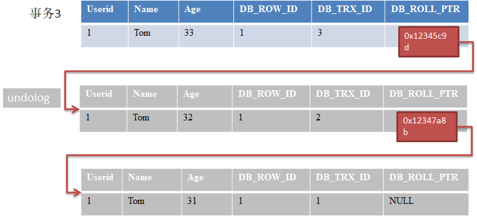
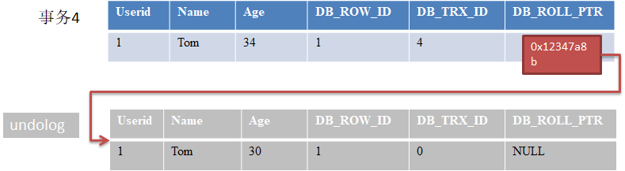
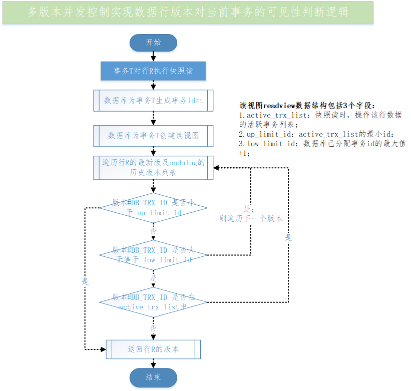

# mysql多版本并发控制-MVCC

## 【0】README

1. 当前读：执行SQL如 select .. for share（共享锁）, select ... for update（排它锁），update, insert, delete 这些操作都是当前读；即当前读指的是事务读取数据的最新版本，读取时还要保证其他并发事务不能修改当前记录，会对读取的记录加锁； 
2. 快照读：不加锁的非阻塞读；基于mvcc实现； 快照读的前提是隔离级别不是串行级别，串行级别下的快照读会退化为当前读； 

3. mvcc可以解决不可重复读问题，简单幻读问题（如避免银行重复给同一个人发放福利）；
4. mvcc不能解决复杂幻读问题（更新用户名），更新丢失问题（读#修改#写回；多人转账或多人编辑wiki），写倾斜问题（读#决策#写回；医院请休假），这些需要当前读，即加锁来实现；  

## 【1】MVCC多版本并发控制底层原理 

refer2  https://www.cnblogs.com/jelly12345/p/14889331.html 

1. mvcc定义：多版本并发控制， multiple version concurrency control； 
2. 解决的问题：读写冲突； 
3. **实现原理：mvcc依赖3个部分**：
   1. 3个隐式字段；
   2. undo log -撤销日志； 
   3.  read view（读视图）； 

### 【1.1】3个隐式字段

1. 每个数据行的3个隐式字段如下。

   1. DB_TRX_ID：最后一次修改当前行（新增或更新）的事务id；（事务id由数据库分配，单调递增）
   2. DB_ROLL_PTR：回滚指针，指向当前行的上一个版本记录； 
   3. DB_ROW_ID：自增的隐藏主键ID；如果表没有主键， innodb会自动以 DB_ROW_ID创建一个聚簇索引； 
   4. 补充：还有一个隐藏字段，delete_flag，用于标记删除；

2. 【例】user表的数据行

   1. | name | age  | DB_ROW_ID(隐藏主键) | DB_TRX_ID(事务id) | DB_ROLL_PTR |
      | ---- | ---- | ------------------- | ----------------- | ----------- |
      | tom  | 30   | 1                   | 1                 | NULL        |

### 【1.2】undo log（撤销日志）

1. undo日志（撤销日志）：用于事务回滚的日志；undo日志是同一个数据行的多个版本组成的链表； 
2. undo日志主要分为两种类型：
   1. insert undo日志：新增操作的撤销日志；
   2. update undo日志：更新操作的撤销日志（包括update或delete）； 

#### 【1.2.1】undolog例子

1. 事务A向user表插入一条新记录，如下：
   1. 数据库为事务A分配的事务ID为1； 
   2. 插入的数据行，DB_ROLL_PTR 为NULL ； 

| userid | name | age  | DB_ROW_ID(隐藏主键) | DB_TRX_ID(事务id) | DB_ROLL_PTR |
| ------ | ---- | ---- | ------------------- | ----------------- | ----------- |
| 1      | tom  | 31   | 1                   | 1                 | NULL        |

2. **事务B修改tom的年龄为32**，如下：
   1. 数据库为事务B分配的事务ID为2； 
   2. 事务B修改数据时，数据库对该行加排它锁；
   3. 把该行数据拷贝到undo log中，作为老版本；
   4. 拷贝完后，修改该行的age为32， 修改改行的DB_TRX_ID=2，修改DB_ROLL_PTR指向上一个版本（刚刚拷贝到undolog的副本）；
   5. 事务B提交后，数据库释放该行的排它锁；

3. 事务C修改tom的年龄为33，如下：
   1. 数据库为事务B分配的事务ID为3； 
   2. 事务B修改数据时，数据库对该行加排它锁；
   3. 把该行数据拷贝到undo log中，作为老版本；发现该行已经有undolog链表，则把当前老版本与undolog链表合并，且当前（最新）老版本作为链表头；
   4. 拷贝完后，修改该行的age为33， 修改改行的DB_TRX_ID=3，修改DB_ROLL_PTR指向上一个版本（刚刚拷贝到undolog的副本）；
   5. 事务B提交后，数据库释放该行的排它锁；

#### 【总结】undolog-撤销日志

行数据的undolog实际是该行数据副本的链表，记录的是同一个行数据被相同事务或不同事务修改时的副本，这些副本通过DB_ROLL_PTR链接起来；

------

### 【1.3】read view读视图

1. 读视图定义：事务在进行快照读产生的视图；
   1. 在事务执行快照读那一刻，数据库会生成一个快照，即读视图，记录并维护数据库当前活跃事务ID（没有提交的事务）； 
2. 读视图作用：**数据库会把读视图与数据行的最新版及undolog链表中旧版本列表的DB_TRX_ID做比较**，以判断当前事务能够看到哪个版本的数据，既可以是当前最新数据，也可以是undolog中某个版本的数据；
3. 具体的，读视图是一个数据结构；有3个字段如下：
   1. active_trx_list（自定义）：活跃事务列表；
   2. up_limit_id： 记录 trx_list中最小事务id；
   3. low_limit_id： 数据库已分配的最大事务ID+1；

#### 【1.3.1】判断数据行的哪个版本对当前事务可见

1. 遍历数据行的最新版本及undolog链表的老版本，每个版本与当前事务的读视图做比较，判断数据行的哪个版本对当期事务可见； 判断条件如下：
   1. 步骤1：若版本1#DB_TRX_ID 小于 当前事务读视图#up_limit_id ，说明当前事务执行快照读时，该版本1已提交事务；所以该版本对当前事务可见，返回版本1；否则继续判断；
   2. 步骤2：若版本1#DB_TRX_ID 大于等于 当前事务读视图#low_limit_id，说明版本1在当前事务产生读视图后提交的，所以版本1对当前事务不可见，继续判断；
   3. 步骤3：若版本1#DB_TRX_ID在 active_trx_list中，说明当前事务执行快照读前，版本1所在事务还没有提交，所以版本1对当前事务不可见；否则，继续判断；
      1. 否则，即若版本1#DB_TRX_ID 不在 active_trx_list中，说明当前事务执行快照读前，版本1所在事务已经提交，所以版本1对当期事务可见，返回版本1；

#### 【1.3.2】例子：数据行不同版本对当前事务可见性 

1. 若事务2修改user表中tom的年龄为32（初始值30），数据库为事务2创建行tom的读视图； 此时，事务1和事务3也正在执行事务；事务4刚好提交了事务（修改tom的年龄为34）；
2. 执行时序如下（补充：开启事务并不会分配事务Id，操作数据库的时候才会分配事务ID）：

| 时序 | 事务1                              | 事务2                              | 事务3                              | 事务4                                     |
| ---- | ---------------------------------- | ---------------------------------- | ---------------------------------- | ----------------------------------------- |
| 1    | 事务开始（执行操作，分配事务id=1） |                                    |                                    |                                           |
| 2    |                                    | 事务开始（执行操作，分配事务id=2） |                                    |                                           |
| 3    |                                    |                                    | 事务开始（执行操作，分配事务id=3） |                                           |
| 4    |                                    |                                    |                                    | 事务开始（执行操作，分配事务id=4）        |
|      |                                    |                                    |                                    | 修改age=34（对tom行执行快照读），提交事务 |
| 5    | 操作中                             | 修改age=32（对tom行执行快照读）    | 操作中                             |                                           |
| 6    | ...                                | ...                                | ...                                | ...                                       |

3. 数据库为事务2在tom数据行上创建的读视图如下：
   1. active_trx_id：{1， 3} ； 因为事务1和事务3还在执行，还没有提交； 
   2. up_limit_id：1；
   3. low_limit_id：5 （当前已分配的最大事务id+1=4+1）
4. tom数据行的最新版本与undolog链表的老版本列表如下（因为事务2还没有提交事务，所以最新版本还是事务4提交的）：
   1. 最新版本即事务4提交的；
   2. undolog链表的老版本列表：目前只有事务0提交的；  

5. 判断步骤如下（遍历tom数据行的所有版本，并与读视图做比较）：

   1. 最新版#DB_TRX_ID=4， 不在active_trx_id 里面，所以最新版对事务2是可见的，返回最新版； 

   ------

   

### 【1.4】总结：MVCC实现数据行版本对当前事务可见性

### 【1.5】MVCC的几个问题？

#### 【1.5.1】快照读时间点非常关键

1. 场景1： 事务B的快照读在事务A提交前执行； 

| 时序 | 事务A                                | 事务B                                        |
| ---- | ------------------------------------ | -------------------------------------------- |
| 1    | 开启事务                             | 开启事务                                     |
| 2    | select快照读，查询客户张三的余额=500 |                                              |
| 3    |                                      | select 快照读，查询客户张三的余额=500        |
| 4    | 更新余额为400                        |                                              |
| 5    | 提交事务                             |                                              |
| 6    |                                      | 再次select快照读，查询客户张三的余额=**500** |

2. 场景2： 事务B的快照读在事务A提交后执行； 

|      | 事务A                                | 事务B                                                    |
| ---- | ------------------------------------ | -------------------------------------------------------- |
| 1    | 开启事务                             | 开启事务                                                 |
| 2    | select快照读，查询客户张三的余额=500 |                                                          |
| 3    | 更新余额为400                        |                                                          |
| 4    | 提交事务                             |                                                          |
| 5    |                                      | select快照读，查询客户张三的余额=400                     |
| 6    |                                      | select ... for share 当前读， 查询客户张三的余额=**400** |

分析：场景1和场景2中， 事务B读取到的张三余额是不同的；原因在于事务B执行张三行的快照读的时间点不同；

#### 【1.5.2】读已提交rc和可重复读rr隔离级别下的快照读的不同

1. 可重复读rr下：事务第1次执行快照读，数据库会为读取的数据行创建读视图ReadView；在当前事务提交前都会复用这个读视图； 
2. 读已提交rc下：事务每次执行快照读时，数据库都是会给读取的数据行创建全新的读视图ReadView；

