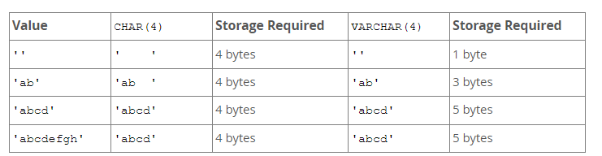
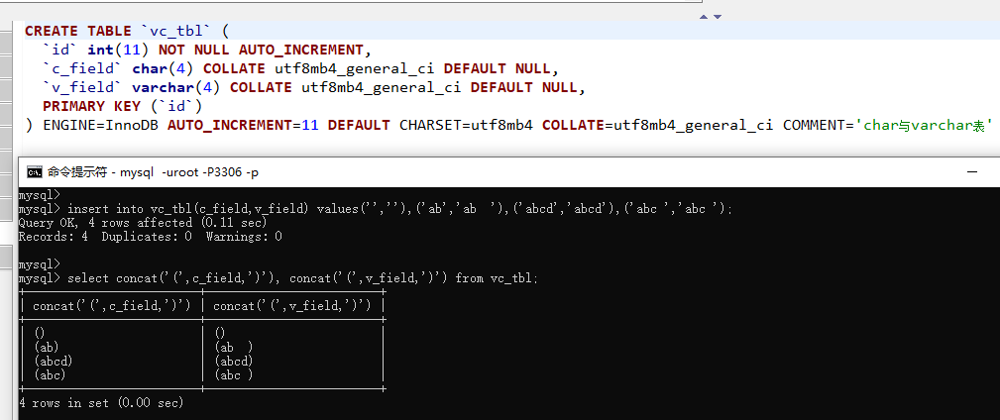
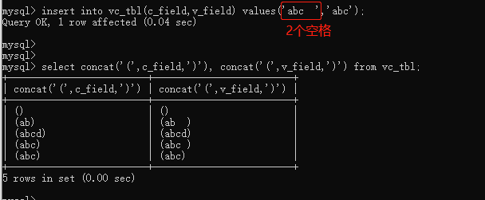
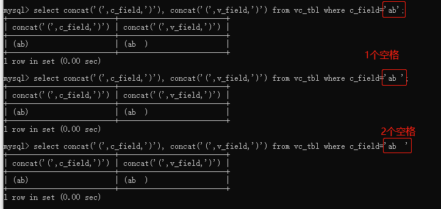

# mysql定长与变长字符串

## 【1】char与varchar介绍

char与varchar类型相似，但他们的存储与查询方式不同，在最大长度和是否保留末尾空格也不同；  

### 【1.1】char

1. char类型字段的长度是定长的；长度可以从0到255（单位字节） ；
2. 当char类型字段被存储时，会在右边补充空格到最大长度；
3. 当char类型的值被搜索时， 末尾空格会被删除，除非开启 PAD_CHAR_TO_FULL_LENGTH sql模式；
4. InnoDB会把大于等于768字节的定长字段的数据编码为可变长度字段， 超出768字节的部分会存储到页外； 如，char(255)类型的列，当字符集超过3个字节如utf8mb4，就会超过768字节；（255*3=765） ； 

### 【1.2】varchar 

1. varchar类型的字段是变长的；长度可以从0到65535（单位字节）； 
2. varcarh类型的最大长度受限于字符集和最大行大小（65535字节，一行的字节大小在所有列之间共享）； 
3. 长度前缀：varchar类型的值会存储为1个或2个字节长度前缀再加上本身的值数据；长度前缀：表示数据的字节个数；
   1. 使用1个字节保存长度：若varchar类型的值长度小于等于255字节；
   2. 使用2个字节保存长度：若varchar类型的值长度大于255字节；

### 【1.3】字符截取 

当严格sql模式没有开启，你赋值给char或varchar类型列，且超过了最大长度，则该值会被截取以适应最大长度； 对于截取非空字符，你可能导致错误发生并使用严格sql模式阻止插入；

1. 对于varhcar类型列：无论使用何种sql模式， 超过列长度的末尾空格都会在插入前被截取，并生成警告信息；  
2. 对于char类型列：无论使用何种sql模式，都会截取多余的末尾空格 ；

### 【1.4】末尾填充 

1. 对于varchar列：当被存储时末尾不会被填充空格； 当存储与查询时，末尾空格会被保留，以符合标准sql ； 
2. 对于char列：当char类型字段被存储时，会在右边补充空格到最大长度； 

### 【1.5】char与varchar存储与查询例子

1. char类型与varchar类型列存储值的处理方法演示： 

补充：在没有使用严格sql模式下，第4行的值才能够正确插入； 如果开启了严格sql模式， 超过列长度的数据不能存储，而是报错；

#### 【演示分析】

1. char类型对末尾空格做了截取，而varchar类型没有；

2. char(4)类型列的值如果是空串，实际上存储的是4个空格，因为数据库会补齐；

3. char(4)类型查询结果：对末尾空格做过滤；如果char(4) 列作为查询条件，则查询条件的值也会做末尾空格过滤； 

4. char(4)类型列数据保存时：也会对末尾空格做过滤； 

   
   

------

## 【2】char与varchar总结

| 比较维度                     | char                                                         | varcha                                                       |
| ---------------------------- | ------------------------------------------------------------ | ------------------------------------------------------------ |
| 字符类型                     | 定长字符类型                                                 | 变长字符类型                                                 |
| 可定义的最大长度（单位字节） | 255                                                          | 65535                                                        |
| 是否需要额外字节             | #                                                            | 存储字节长度小于等于255，额外申请1个字节存储； 存储字节长度大于255，额外申请2个字节存储； |
| 页外存储                     | 大于等于768字节的定长字段的数据编码为可变长度字段，  超出768字节的部分会存储到页外； | #                                                            |
| 数据存储                     | 过滤掉末尾空格（非空格字符长度不超过最大长度，就可以成功保存，即便非空格字符与空格字符长度之和大于最大长度） | 不过滤                                                       |
| 查询条件                     | 过滤掉查询条件值的末尾空格                                   | 不过滤                                                       |
| 查询结果                     | 过滤掉末尾空格（与查询条件类似）                             | 不过滤                                                       |

## References

https://blog.csdn.net/qq_39390545/article/details/109379218

https://dev.mysql.com/doc/refman/8.0/en/char.html

