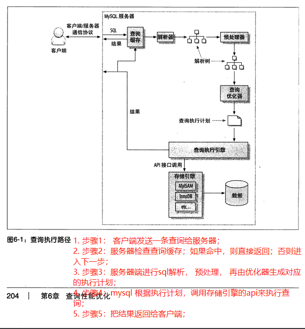
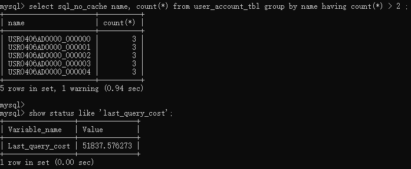

# 【高性能mysql-6】mysql性能优化

【readme】 本文总结自《高性能mysql》第6章；  

## 【6.1】为什么查询速度这么慢

1. 编写快速的查询sql之前，**主要关注的是响应时间**；
   1. 查询看做一个任务 ，它有多个子任务组成；
   2. 若要优化查询性能，或者优化单个子任务，或者减少子任务个数，或者减少子任务执行次数，或者两者一起优化；
2. 查询执行顺序如下：
   1. 客户端；
   2. 服务器；
      1. 解析；
      2. 生成执行计划；
      3. 执行（最重要阶段，包括了大量为了检索数据到存储引擎的调用，以及调用后的处理，如排序与分组）；
      4. 返回结果；
3. 查询需要的时间花费：
   1. **包括网络，cpu计算，生成统计信息和执行计划，锁等待（互斥等待）等操作**； 
   2. 尤其是向存储引擎的调用操作，这些调用需要在内存，**cpu操作和内存不足时导致的IO操作，如文件排序**；
   3. 根据存储引擎不同，可能会产生大量的上下文切换及系统调用； 
4. 优化查询的目的：就是为了减少和消除这些操作所花费的时间； 

## 【6.2】慢查询基础：优化数据访问 

1. 查询性能低下最基本的原因： 访问的数据太多；

2. 对于低效查询，通过如下两个步骤来分析很有效；
   1. 步骤1：确认应用程序如jdbc客户端是否在检索大量超过需要的数据；（**可能访问了太多行或太多列**）
   2. 步骤2：确认mysql服务器层是否在分析大量超过需要的数据行；

### 【6.2.1】第1步：是否向数据库请求了不需要的数据

1. 典型案例：
   1. 查询不需要的记录； 
   2. 总是取出全部列（使用select *）； 
      1. 取出全部列，会让优化器无法完成 索引覆盖扫描这类优化，为服务器带来额外的IO，内存和cpu的消耗； 
      2. 取出全部列，也不总是坏事，如可以增加sql复用，构建缓存等；但应该要清楚查询所有列的缺点，合理选择；
   3.  重复查询相同的数据；如用户头像或名字（这其实利用缓存来解决）

### 【6.2.2】第2步：mysql是否在扫描额外的记录

1. 最简单地衡量查询开销的3个指标（这3个指标都会记录到mysql的**慢日志**中）：
   1. 响应时间； 
   2. 扫描行数； 
   3. 返回行数；  

#### 【6.2.2.1】响应时间

1. 响应时间=服务时间+排队时间；
   1. 服务时间：数据库处理这个查询真正花费的时间；
   2. 排队时间：服务器因为等待某些资源而没有执行查询的时间；如等待IO操作，锁等待；

#### 【6.2.2.2】扫描行数与返回行数

理想情况下，扫描行数与返回行数应该是相同的； 但实际上并不是； 

如在做关联查询时， 服务器必须要扫描多行才能生成结果集中的一行；

##### 【6.2.2.2.1】扫描行数和访问类型 

explain查询执行计划的结果中，type列反应了访问类型； 

【说明】using where： 表明mysql将通过 where条件筛选存储引擎返回的记录；  

1. **访问类型-type列（速度从慢到快，扫描行数从大到小）**：
   1. all：全表扫描；
   2. index：全索引扫描；
   3. range：范围扫描；
   4. ref： 使用非唯一索引或唯一索引前缀扫描，返回某个单独值的记录行； 
   5. eq_ref： 使用唯一索引扫描，如主键或唯一键；
   6. const/system： 常量查询； 
      1. system是const的特例，当查询的表只有一行时使用system； 
2. mysql使用如下3种方式应用where条件（从好到坏）：
> 1. 索引中使用 where 过滤不匹配的记录；（在存储引擎层完成）； 
   2. 使用索引覆盖扫描（extra列中出现using index）返回记录；直接从索引中过滤不需要的记录并返回命中结果； （这是在mysql服务器完成的，但无需再回表查询）； 
   3. 从数据库表中反馈数据，然后过滤不满足条件的记录（extra列出现using where）；这是在mysql服务器完成，mysql先从数据库表读出记录然后过滤；  
3. 若查询语句的扫描行数大于结果行数，可以使用的优化策略如下：
   1. 使用索引覆盖扫描； 把所有列都放入索引，无需回表；
   2. 改变库表结果； 如单独的汇总表；
   3. 重写这个复杂的查询sql，让mysql优化器能够以更优的方式执行这个查询； 

## 【6.3】重构查询的方式

### 【6.3.1】一个复杂查询还是多个简单查询

设计查询时要考虑一个重要问题： 是否需要将一个复杂查询分成多个简单子查询； 

### 【6.3.2】切分查询

分治思想；

如删除历史数据；并不是一次性删除所有历史数据，而是采用小批量删除，如每次删除1万，或500条数据； 

### 【6.3.3】分解关联查询（使用单表查询） 

1. 简单说：把一个连表查询拆分为多个单表查询，然后在应用程序如java内存中做关联；  
2. 优势；
   1. 让缓存的效率更高； 
   2. 单个查询可以减少锁竞争；
   3. 可以在应用中执行哈希关联（连表），而不是使用mysql的嵌套循环关联；某些场景哈希关联的效率要高很多；  
   4. 查询本身效率也可以提升； （如使用in子句代替关联查询，可以让mysql按照id顺序进行查询，这比随机的关联要更高效）
   5. 可以减少冗余记录的查询； 

## 【6.4】查询执行的基础

1. mysql执行查询步骤（客户端如jdbc，服务器如mysql服务器）：
   1. 步骤1： 客户端发送一条查询给服务器； 
   2. 步骤2：服务器检查查询缓存；如果命中，则直接返回；否则进入下一步； 
   3. 步骤3：服务器端进行sql解析， 预处理， 再由优化器生成对应的执行计划；  
   4. 步骤4：mysql 根据执行计划，调用存储引擎的api来执行查询；  
   5. 步骤5：把结果返回给客户端；   

 

### 【6.4.1】mysql客户端与服务器通信协议

1. mysql客户端与服务器之间采用 半双工通信协议进行通信；即同一时刻，要么是服务器向客户端发送数据，要么是客户端向服务器发送数据，而这2个动作不能同时进行； 
2. 缺点：
   1. **无法进行流量控制**； 一旦一端开始发送消息，另一端需要接收整个消息才能响应它； （哪怕另一端如客户端的内存快要oom，服务器还是照常向客户端发送消息，要么客户端接收整个消息，要么客户端可能在接收过程中报oom而宕机，连接中断，要么因超时而连接中断）
   2. 客户端用一个单独的数据包把查询请求或查询sql发送给服务器。 这也是为什么当查询语句很长的时候，参数 max_allowed_packet 就特别重要； 一旦客户端发送了请求，它唯一能做的事情是等到服务器返回结果； 

3. 多数连接mysql的库函数都**可以获取全部结果集并缓存到内存里**；
4. mysql通常需要等到所有数据都发送给客户端才能释放这条查询所占用的资源； 所以接收全部结果并缓存通常可以减少服务器的压力，让查询能够早点释放资源；  

#### 查询状态

1. 一个mysql连接（或线程），任何时刻都有一个状态， 该状态表示了mysql当前正在做什么； 
2. 使用 show full  processlist 命令查看；查询结果的 command列就是状态；
   1. sleep：线程正在等待客户端发送新请求； 
   2. query：线程正在执行查询或正在将结果发送给客户端；  
   3. locked：该线程正在等待表锁；  
   4. analyzing and statistics： 线程正在收集存储引擎的统计信息，并生成查询的执行计划；  
   5. copying to tmp table【on disk】：线程正在执行查询，并且将结果集都复制到一个临时表中 ； 
      1. 这种状态要么在做group by， 要么是文件排序，要么是 union； 
      2. 如果这个状态还有 on disk 标记， 表示mysql正在将一个内存临时表放到磁盘上；  
   6. sorting result： 对结果集进行排序；  
   7. sending data： 线程在传送数据， 或者在生成结果集，或者在向客户端发送数据； 

### 【6.4.2】查询缓存 

1. 在解析一个查询语句前， 如果查询缓存是打开的，那么mysql会优先检查这个查询是否命中查询缓存中的数据； 
2. 这个检查是通过一个哈希查找实现的； （对查询语句生成一个hashkey） 

### 【6.4.3】查询优化处理

1. 若缓存没有命中，则mysql会把sql转换为一个执行计划， mysql在根据这个执行计划与存储引擎进行交互；  
   1. 包括多个子阶段： 解析sql， 预处理， 优化 sql 执行计划； 

#### 【6.4.3.1】语法解析器和预处理 

1. 语法解析器： 使用mysql语法规则验证和解析查询；  （主要检查语法是否正确 ）
2. 预处理器：进一步检查解析树是否正确；（如检查数据表和列是否存在，还会解析名字和别名）

#### 【6.4.3.2】查询优化器 

1. 优化器： 把sql转换为 执行计划；  并找到其中最好的执行计划（成本最小的一个执行计划）；  
   1. 注意： 成本的最小单位是随机读取1个大小为4K的数据页； 
2. 【例】执行where条件比较的成本 ，可以通过查询 **last_query_cost**的值来获取mysql计算的当前查询的成本；(下图表示mysql优化器认为 需要做51837个数据页的随机查找才能完成上面的查询)    

 

3. **mysql优化器选择错误执行计划的原因：** 
   1. 统计信息不准确。 如InnoDB因为其 MVCC架构，导致不能维护一个精确的行数统计，可以理解为是一个缓存值；
   2. 执行计划中的成本估算**不等于**实际执行的成本； 
      1. 即使统计信息是精确的，优化器给出的执行计划也可能不是最优的。如某个执行计划虽然读取更多的页面，但这些页面在内存或者全部是顺序读，则其成本会更小；  
   3. mysql的最优与开发人员的最优不一样：
      1. 开发人员认为执行时间最短算最优；
      2. mysql基于成本模型来估算最优，即最小成本是随机读取1个大小为4K的数据页；
   4. 优化器无法去估算所有可能的执行计划，所以它可能错过实际上最优的执行计划（这就是为什么在某些业务场景下，需要手动强行指定索引的原因了）；   
   5. mysql不会考虑不受其控制的操作成本：如执行存储过程或用户自定义函数的成本； 
4. mysql的查询优化器：使用了很多优化策略，来生成一个最优的执行计划； 
   1. 优化策略分为： 静态优化， 动态优化； 
      2. 静态优化：可以认为是编译时优化； 静态优化可以直接对解析树进行分析，并完成优化； 静态优化在第一次完成后一直有效， 即使使用不同的参数重复执行查询也不会发生变化； 
      2. 动态优化： 可以认为是运行时优化； 在每次查询时都需要评估；如索引中条目对应的数据行数；

##### 【6.4.3.2.1】**mysql能够处理的优化类型**：

1. 重新定义关联表的顺序：小表驱动大表； 
2. 将外连接转换为内连接； （mysql可以识别出让外连接等价于一个内连接，并重写查询，，让其可以调整关联顺序）
3. 使用等价变换原则：如可以优化布尔表达式； 如（5=5 and a>5） 被改写为 a>5；
4. 优化 count(), min(), max() 聚合函数； 
   1. 查找某列最小值：只需要查询b-tree索引最左端的记录；
   2. 查找某列最大值：只需要查询b-tree索引最左端的记录；
   3. （如果mysql使用了上述2种类型的优化， 在 explain中可以看到  select tables optimized away ，字面意思是，优化器已经从执行计划中移除了该表，用一个常数代替它）
5. 预估并转化为常数表达式：当mysql 检测到一个表达式可以转换为常数的时候， 就会一直把这个表达式当做常数处理；
   1.  
6. 覆盖索引扫描：当索引中的列包含查询需要的列时，mysql就可以使用索引返回需要的数据，而无需回表 ；
7. 子查询优化：在某些情况下可以将子查询转换为一种效率更高的形式，从而减少多个查询多次对数据进行访问；
8. 提前终止查询； 在发现已经 满足查询需求的时候，mysql总是能够立刻终止查询；
   1. 如 limit子句；  
   2. 当发现一个不成立的条件时，mysql可以立刻返回一个空结果；  （这个例子可以看到， 查询在优化阶段就终止了）
      1. 
9. 等值传播：如果两个列的值通过等式关联，那么 mysql能够把其中一个列的where条件传递到另一个列上；（注意要等值关联才行）
10. 列表 in() 的比较：mysql 将in() 列表中的数据先进行排序，然后通过二分查找的方式来确定列表中的值是否满足条件，这是一个 O(logn) 复杂度的操作， 等价转换为OR查询的复杂度为O(n) ；对于in列表中有大量取值的时候，mysql的处理速度会更快； 
    1. 对in子句中的元素进行二分查找，所以时间复杂度是O(logn)； 
    2. 对or语句中的元素是全部遍历（最坏情况），时间复杂度是O(n)； 
    3. 综上： 特别对于元素比较多的情况，使用in子句性能要优于 or语句； 
11. 开发人员可以帮助mysql优化器做进一步优化： 如果能够确认优化器给出的不是最佳选择的话； 
    1. 如， 可以在查询中添加hint提示， 也可以重写查询；或者重新设计更优的库表结构， 或者添加更合适的索引；  
    2. 关于如何在sql中添加索引提示（index hint），refer2 ：； 

1. 数据和索引的统计信息：
   1. 服务器层有查询优化器，但没有保存数据和索引的统计信息；统计信息由存储引擎实现， 不同的存储引擎可能会存储不同的统计信息；
   2. 优化器可以根据统计信息选择一个最优的执行计划，统计信息包括：
      1. 每个表或索引有多少个页面； 
      2. 每个表的每个索引的基数是多少； 
      3. 数据行和索引长度，索引的分布信息；

##### 【6.4.3.2.2】mysql如何执行关联查询：

1. 总体上， mysql认为任何一个查询都是关联查询（如单表查询也是关联查询）； 
2. mysql关联执行的策略很简单： mysql对任何关联都执行**嵌套循环关联**操作；详情如下：
   1. 先从第1个表中取出单条数据；
   2. 然后再嵌套循环到下一个表中寻找匹配的行，依次下去，直到找到表中所有匹配的行为止；  
   3. 
3. **嵌套循环关联查询步骤**：
   1. 查询外层表的数据行， 并构建外层表的迭代器；
   2. 遍历外层表迭代器，获取单个外层表数据行（第1层循环）；
      1. 根据单个外层表数据行查询内层表的数据行，并构建内层表迭代器；
      2. 遍历内层表迭代器，获取单个内层表数据行（第2层循环）；
         1. 合并外层与内层表数据行，构建输出结果；
         2. 内层表迭代器滑动；
   3. 外层表迭代器滑动； 

4. 左外关联查询的伪代码例子：

【总结】本质上讲， mysql对所有类型的查询都是以同样的方式运行； 

1）如： mysql在from子句中遇到子查询时， 先执行子查询，并将结果放到一个临时表中，然后把这个临时表当做一个普通表对待（即派生表）； 需要注意的是：**临时表是没有任何索引的**； 在编写复杂的子查询，关联查询，或union查询时需要注意；

##### 【6.4.3.2.3】执行计划 

1. mysql收到查询请求时，会生成一颗指令树，然后通过存储引擎执行指令树来返回结果； 
2. 最终的执行计划包含了重构查询的所有信息；
   1. 执行 explain extended，再执行 show warnings ，就可以看到重构出的查询； 
3. **mysql是嵌套循环关联查询方式：** mysql总是从一个表开始一直嵌套循环， 回溯完成所有表关联，是一颗左侧深度优先的树； 

##### 【6.4.3.2.4】关联查询优化器（多表关联顺序）

