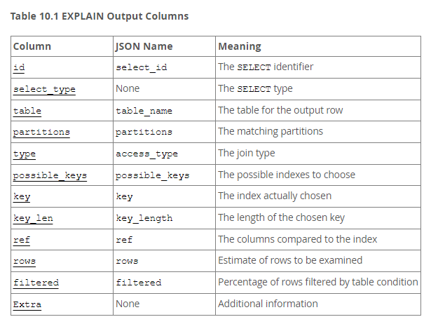
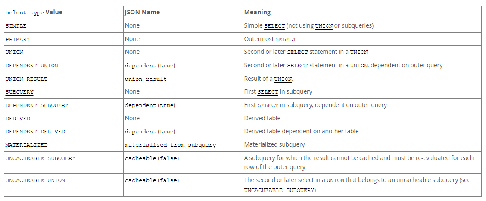
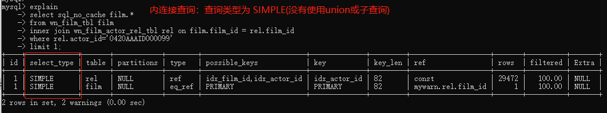
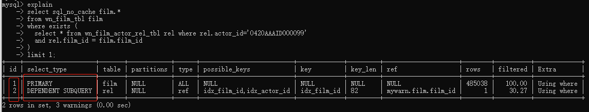
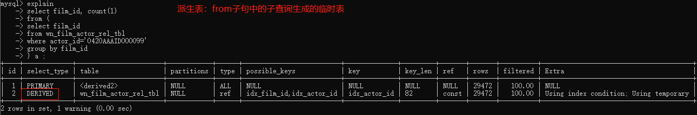
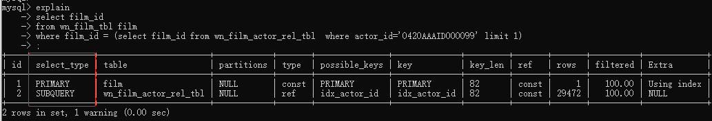
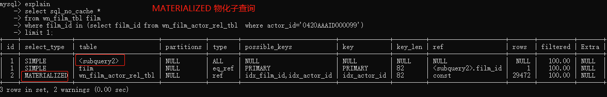

# 理解mysql执行计划

# 【1】使用EXPLAIN优化查询

refer2 https://dev.mysql.com/doc/refman/8.0/en/using-explain.html 

1. explain提供了关于mysql如何执行语句的信息；
   1. EXPLAIN 可以作用于 SELECT, DELETE, INSERT, REPLACE 和 UPDATE 语句； 
   2. 当EXPLAIN作用于sql语句时， mysql会展示优化器关于语句执行计划的信息；即， mysql如何执行sql语句，包括数据库表如何关联及关联顺序； 
   3. 对于 SELECT 语句， explain 会产生额外的执行计划信息，需要通过 show warnings 来展示； 参见 https://dev.mysql.com/doc/refman/8.3/en/explain-extended.html 
   4. FORMAT 选项： 能够用于选择explain结果的输出格式； 
      1. TRADITIONAL 呈现的是 表格样式；也是默认格式；
      2. JSON 格式以JSON格式展示信息；
2. 在 explain的帮助下， 你可以新增索引，你也可以检查优化器是否以最优顺序关联表；
   1. 可以使用 SELECT STRAIGHT_JOIN  而不是 SELECT 给优化器一个提示，让其按照sql中表的声明顺序进行关联；
   2. 然而 SELECT STRAIGHT_JOIN 可能会禁止使用索引，因为它禁用了半连接转换， 详情参见 https://dev.mysql.com/doc/refman/8.0/en/semijoins.html


------

# 【2】EXPLAIN 输出格式 

https://dev.mysql.com/doc/refman/8.0/en/explain-output.html 

## 【2.1】EXPLAIN 输出列



| 列名          | 含义                                     | 备注                                                         |
| ------------- | ---------------------------------------- | ------------------------------------------------------------ |
| id            | 执行序号                                 | 若select_type相同，则id越大越先执行，<br/>id相等则按照explain结果从上到下顺序执行；<br>若select_type不同，则根据实际情况;<br>（如PRIMARY会先于DEPENDENT SUBQUERY执行，即便PRIMARY#id=1，而DEPENDENT SUBQUERY#id=2） |
| select_type   | SELECT类型或查询类型                     | 如 SIMPLE, PRIMARY,UNION, <br/>DEPENDENT UNION, UNION RESULT, <br/>SUBQUERY, DEPENDENT SUBQUERY, <br/>DERIVED, DEPENDENT DERIVED,  <br/>MATERIALIZED, UNCACHEABLE SUBQUERY,UNCACHEABLE UNION. |
| table         | 数据库表                                 |                                                              |
| paritions     | 分区                                     |                                                              |
| type          | 表关联方式                               | mysql认为即便操作一张表，也是关联;<br>如 system, cost, eq_ref, ref, fulltext, ref_or_null,<br> index_merge, unique_subquery, index_subquery, <br>range, index, all |
| possible_keys | 可能使用到的索引名                       |                                                              |
| key           | 实际使用的索引名                         |                                                              |
| key_len       | 实际使用索引名的长度                     | 该值可以让你确定多列组合索引实际使用了哪些列                 |
| ref           | 与索引比较的查询列                       |                                                              |
| rows          | 必须扫描的数据行数                       | 一个估计值，非实际值；                                       |
| filtered      | 根据条件对表过滤出的行数占总行数的百分比 | 如等于100，表明没有过滤发生；<br>filtered值减少表明过滤出的行数在增加； <br>rows乘上filtered表示该表参与表关联的数据行数； |
| extra         | mysql如何解析查询的其他信息              |                                                              |

### 【2.1.1】select_type（查询类型）

 

| select_type          | 含义                                                      | 备注 |
| -------------------- | --------------------------------------------------------- | ---- |
| SIMPLE               | 简单查询；没有使用union或子查询                           |      |
| PRIMARY              | 最外层的SELECT查询                                        |      |
| UNION                | UNION语句中第2及之后的SELECT语句                          |      |
| DEPENTDENT UNION     | UNION语句中第2及之后的SELECT语句，依赖外层查询            |      |
| UNION RESULT         | union合并结果                                             |      |
| SUBQUERY             | 子查询的第1个SELECT                                       |      |
| DEPENDENT SUBQUERY   | 子查询的第1个SELECT，依赖外部查询                         |      |
| DERIVED              | 派生表                                                    |      |
| DEPENDENT DERIVED    | 依赖另一张表的派生表                                      |      |
| MATERIALIZED         | 物化子查询                                                |      |
| UNCACHEABLE SUBQUERY | 子查询结果不能缓存，且必须与外查询的每行重新关联          |      |
| UNCACHEABLE UNION    | union中属于 uncacheable suqbuery的第2个及之后的select语句 |      |

补充：DEPENDENT通常表示： 使用了相关子查询；参见 https://dev.mysql.com/doc/refman/8.0/en/correlated-subqueries.html

相关子查询定义：指的是包含一个到外层表引用的子查询（如下： 子查询的表是t2，但它使用到外层表t1的引用）；

````sql
SELECT * FROM t1
  WHERE column1 = ANY (SELECT column1 FROM t2
                       WHERE t2.column2 = t1.column2);
````


#### 【2.1.1.1】SIMPLE（简单查询，没有union与子查询）



#### 【2.1.1.2】PRIMARY（最外层查询） + DEPENDENT SUBQUERY（相关子查询） 



这是一个相关子查询，因为子查询包含外层表的引用（子查询的表是 rel表，但其引用了外层表file）；  

对于select_type，虽然 PRIMARY#ID=1, DEPENDENT_SUBQUERY#ID=2， 但PRIMARY表示外层查询，会先执行；DEPENDENT SUBQUERY 是相关子查询，后执行（虽然 DEPENDETN SUBQUERY的id 大于 PRIMARY的id）； 


#### 【2.1.1.3】DERIVED（派生查询）

派生表：派生表是一个虚表， 是在查询from子句范围内生成表的表达式； 如select语句from子句中的子查询是派生表；

```sql
SELECT ... FROM (subquery) [AS] tbl_name ...
```




#### 【2.1.1.4】SUBQUEYR （子查询）

 

先执行子查询，在执行主查询；


#### 【2.1.1.5】 MATERIALIZED（物化子查询 ）



执行顺序： 因为id=1，且table=subquery2 指向了 MATERIALIZED ，所以先执行id=2的物化子查询，然后执行 subquery2读取全表扫描，最后执行film的简单查询；  

------


## 【2.2】EXPLAIN 连表类型（type列）

下面的清单描述了连表类型， 性能从最好到最差排序如下：

1. system： 数据库表只有一行；它是const 连表类型的特例； 
2. const： 数据库表至多只有一行匹配； const连表类型被用于把主键或唯一键与常量做比较的时候；
3. eq_ref： 从一个表读取一行与另一个表的每一行做比较（可以有多行匹配）； 除了system与const，eq_ref 是最好的连表类型； 
   1. eq_ref 连表类型： 被用于当连表使用索引的所有部分且索引是主键索引或唯一索引的时候； 
   2. eq_ref 可以用于使用 = 运算符进行比较的索引列（<font color='red'>注意需要等号比较</font>）； 
4. ref： ref连表类型被用于当连表使用最左前缀匹配，或者索引不是主键或唯一索引时（即普通索引）；
   1. ref 连表类型： 可被用于当索引列使用 = 或 <> 运算符比较的时候（等号或不等号）；
5. fulltext： 连表使用 FULLTEXT（全文） 索引； 
6. ref_or_null： 与ref类型， 但是它会额外增加一个包含 NULL 的搜索； 该连表类型优化通常在处理子查询时； 

```sql
SELECT * FROM ref_table
  WHERE key_column=expr OR key_column IS NULL;
```

7. index_merge： 该类型表明使用了索引合并优化；参见 https://dev.mysql.com/doc/refman/8.3/en/index-merge-optimization.html 
8. unique_subquery： 该类型在包含in子句的子查询中替换 eq_ref ； 如下；
   1. unique_subquery 仅仅是一个完全替换子查询的索引查找函数；

```sql
value IN (SELECT primary_key FROM single_table WHERE some_expr)
```

9. index_subquery： 该类型用来替换in子句的子查询； 不过他主要作用在子查询的非唯一索引； 

```
value IN (SELECT key_column FROM single_table WHERE some_expr)
```

10. range： 范围查询；range类型被用于当key列与常量通过运算符比较时； 使用的运算符包括 = <> > >= < <= IS NULL BETWEEN LIKE IN()  

```sql
SELECT * FROM tbl_name
  WHERE key_column = 10;

SELECT * FROM tbl_name
  WHERE key_column BETWEEN 10 and 20;

SELECT * FROM tbl_name
  WHERE key_column IN (10,20,30);

SELECT * FROM tbl_name
  WHERE key_part1 = 10 AND key_part2 IN (10,20,30);
```

11. index： 索引树全表扫描（覆盖索引）；
    1. 如果索引是覆盖索引（不回表），且可以满足表中所需的所有数据，则仅扫描索引树； 同时，extra列显示 using index ； 
12. ALL： 磁盘全表扫描； 对先前表的每个行组合进行全表扫描； 这样通常性能非常糟糕，应该尽量避免全表扫描，如通过新增索引；


## 【2.3】EXPLAIN extra 信息

extra列包含mysql如何解析查询的额外信息；

如果你想使你的查询尽可能快，<font color=red>你要找出 值为 using filesort 和 using temporary 的extra列值</font>；

1. backward index scan： 
2. Start temporary, End temporary ：
3. using filesort ：
4. using index：；
5. using join_buffer ：；
6. using temporary； 
7. .........more 


