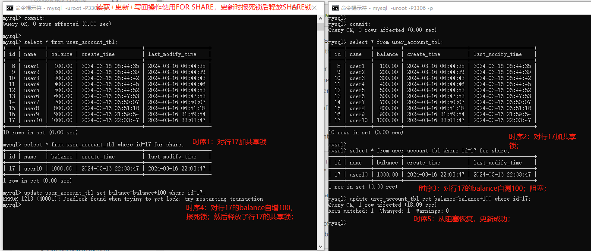

# 锁定读取

refer2 https://dev.mysql.com/doc/refman/8.0/en/innodb-locking-reads.html  

## 【1】两类锁定读取策略

如果在同一个事务中，你查询数据，然后插入或更新相关数据，常规SELECT语句不会提供足够的安全防护。即另一个事务可以更新或删除你刚刚查询的数据。innodb支持两类锁定读取策略，以提供额外的安全保护。

补充： 锁定读取只可能发生在手动提交的情况； 

------


### 【1.1】SELECT ... FOR SHARE 

1. FOR SHARE针对读取的结果行加共享锁，即其他会话（事务）可以读取这些行，但不能修改行数据直到当前事务提交。 
2. 若另一个事务修改了任意一行数据但没有提交，你的查询会等待直到另一事务结束。
3.  mysql8.0.22版本前，SELECT ...FOR SHARE 需要 SELECT 权限和至少 DELETE, LOCK TABLES, UPDATE 权限中的一种； 8.0.22版本后， 该语句不会获取mysql授权表上的读锁； 

【补充】  SELECT ... FOR SHARE 替换了 SELECT... LOCK IN SHARE MODE ， 两者是等价的。 然而， FOR SHARE 支持 表名， NOWAIT, SKIP LOCKED 选项， 详情参见 https://dev.mysql.com/doc/refman/8.0/en/innodb-locking-reads.html#innodb-locking-reads-nowait-skip-locked。 

4. 例子： SELECT .. FOR UPDATE加共享锁演示 

   1. | 时序 | 客户端1                                                      | 客户端2                                                      |
      | ---- | ------------------------------------------------------------ | ------------------------------------------------------------ |
      | 1    | select * from user_account_tbl <br>/where id>=14 and id<=20 for share;【成功】 |                                                              |
      | 2    |                                                              | select * from user_account_tbl <br/> where id>=14 and id<=20 for share;【成功】 |
      | 3    |                                                              | 新增id=17的数据【阻塞（即便id=17的行不存在）】               |
      | 4    | 新增id=18的数据【报死锁，释放共享锁】                        |                                                              |
      | 5    |                                                              | 从阻塞状态恢复；新增id=17成功；                              |
      | 6    | 再次新增id=18的数据【阻塞，直到获取锁超时】                  |                                                              |
      | 7    |                                                              | 提交事务                                                     |
      | 8    | 再次新增id=18的数据【成功】                                  |                                                              |


------


### 【1.2】SELECT ... FOR UPDATE 

1. FOR UPDATE会锁定行和任何关联的索引记录，与对这些数据行执行UPDATE语句类似。
2. FOR UPDATE被执行，则其他事务会被阻止更新这些行，被阻止执行 SELECT ... FOR SHARE， 或者在特定事务隔离级别下被阻止读取数据。
3. 一致性读会忽略读视图中数据行的任意锁。（一行记录的老版本不会被锁住；他们是通过在记录内存副本上应用undo日志来重构的） 
4. SELECT ..FOR UPDATE 需要 SELECT权限且至少需要 DELETE, LOCK TABLES, UPDATE权限中的一种；

### 【1.3】锁释放

所有被 FOR SHARE 和 FOR UPDATE 设置的锁在事务提交或回滚时会被释放；


## 【2】锁定读取例子

### 【2.1】读取+更新+写回操作的问题解决（FOR UPDATE）

1. 为了实现读取并自增counter， 首先使用FOR UPDATE锁定读取该行的counter字段，然后自增counter字段，如下：

   ```sql
   select counter from table FOR UPDATE;
   UPDATE table set counter =  counter + 1
   ```

2. FOR UPDATE例子

3. | 时序 | 客户端1                                                      | 客户端2                                                      |
   | ---- | ------------------------------------------------------------ | ------------------------------------------------------------ |
   | 1    |                                                              | select * from user_account_tbl where id=17 for update; <br/>对行17加FOR UPDATE排它锁；【加锁成功】 |
   | 2    | select * from user_account_tbl where id=17 for update; <br/>对行17加FOR UPDATE排它锁；【加锁失败，超时后报异常】 |                                                              |
   | 3    |                                                              | 更新行17的balance自增100；【成功】                           |

   


#### 【2.1.1】不使用FOR UPDATE的问题

1. 不使用一致性读和共享锁：存在更新丢失的问题；如事务1和事务2同时读取行1#counter=100，同时自增100并更新，各自提交事务； 
2. 使用 FOR SHARE ，至少有一个事务在执行update时会因为死锁而释放共享锁； 



### 【2.2】对不存在的行加共享锁与排他锁

1. 对不存在的行加共享锁 FOR SHARE ，若2个事务同时新增被加锁的行（但不存在），至少有一个事务报死锁；


## 【3】使用NOWAIT和SKIP LOCKED锁定读取并发 

### 【3.1】背景

1）如果某一行被事务锁定，则执行FOR SHARE或FOR UPDATE锁定相同行的事务必须等待直到阻塞事务释放行锁；这个行为阻止事务更新或删除被其他事务查询并更新的行；

2）然而，等待行锁释放不是必须的，如果你希望查询的行被锁定时也可以马上返回（NO WAIT）；或者愿意接收从结果集中排除锁定的行(SKIP LOCKED)；

3）为了避免事务需要等待行锁被释放， NOWAIT 和 SKIP LOCKED选项可以与 FOR UPDATE 或 FOR SHARE 一起使用；

### 【3.2】NOWAIT 

使用NOWAIT的锁定读取从不等待获取行锁，查询会立即返回（执行成功或失败）， 如果请求行被锁定，则会报错；

### 【3.3】 SKIP LOCKED 

使用 SKIP LOCKED的锁定读取从不等待获取行锁； 查询会立即返回，从结果集中移除锁定的行；  

```c++
【注意】
1）使用SKIP LOCKED 的查询返回不一致的数据视图。因此SKIP LOCKED不适合一般性事务工作。但它可以避免当多个会话访问相同队列时的锁竞争；
2）NOWAIT 和 SKIP LOCKED 仅应用于行级锁。 
3）使用 NOWAIT和 SKIP LOCKED的语句对于基于语句的复制是不安全的；
```

## 【4】 例子

### 【4.1】 NOWAIT

1. 客户端1使用FOR UPDATE对行20加排他锁， 客户端2使用FOR UPDATE NOWATI对行20加排它锁；客户端2加锁失败，报错返回，而不是阻塞等待客户端1释放锁；

   | 时序 | 客户端1                                                      | 客户端2                                                      |
   | ---- | ------------------------------------------------------------ | ------------------------------------------------------------ |
   | 1    | select * from user_account_tbl where id=20 for update;<br/>使用FOR UPDATE对行20加排它锁；【成功】 |                                                              |
   | 2    |                                                              | select * from user_account_tbl where id=20 for update nowait;<br/>使用FOR UPDATE NOWAIT 对行20加排它锁；【报错】ERROR 3572 (HY000): Statement aborted because lock(s) could not be acquired immediately and NOWAIT is set. |
   | 3    | 更新行20的balance【成功】                                    |                                                              |

   

### 【4.2】SKIP LOCKED 

1. 客户端1使用FOR UPDATE对行20加排他锁， 客户端2使用FOR UPDATE SKIP LOCKED 对行20加排它锁；客户端2查询结果会过滤掉被锁住的行；

2. 操作时序：

3. | 时序 | 客户端1                                    | 客户端2                                                      |
   | ---- | ------------------------------------------ | ------------------------------------------------------------ |
   | 1    | 使用FOR UPDATE对行20加排它锁；【加锁成功】 |                                                              |
   | 2    |                                            | 使用FOR UPDATE SKIP LOCKED对行20加排它锁；【加锁失败；查询结果集移除了被锁住的行】 |
   | 3    | 提交事务；释放行20的排它锁；               |                                                              |
   |      |                                            | 使用FOR UPDATE SKIP LOCKED对行20加排它锁；【加锁成功】       |


